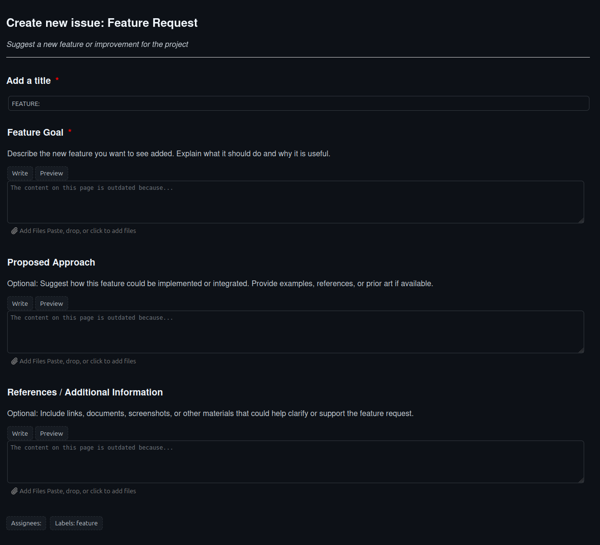

# GitHub Issue Previewer


A lightweight CLI tool that provides real-time preview of GitHub Issue templates (YAML) in your browser. Perfect for designing and testing issue templates before committing them to your repository.

## Features

- 🔄 Live preview with automatic reload when YAML changes
- 🎨 Authentic GitHub-style CSS theming
- 🌐 Local HTTP server with hot-reload capability
- ⚡ Fast and lightweight
- 🚀 Simple CLI interface
- 🔌 Custom browser support

## Installation

This project uses [uv](https://github.com/astral-sh/uv) for package management. Make sure you have uv installed first.

```bash
# Install using uv
uv tool install git+https://github.com/RyoNakagami/github-issue-previewer

# Uninstall if needed
uv tool uninstall github-issue-previewer
```

## Usage

Basic usage:

```bash
github-issue-previewer path/to/issue_template.yml [--port PORT] [--browser BROWSER_PATH]
```

### Arguments

- `yaml_file`: Path to your GitHub issue template YAML file (required)
- `--port`: Port number for the preview server (default: 8000)
- `--browser`: Custom browser path (optional)

### Example Usage

Given a feature request template like this:

```yaml
name: "Feature Request"
description: "Suggest a new feature or improvement"
title: "FEATURE: "
labels: [feature]

body:
  - type: textarea
    id: feature-goal
    attributes:
      label: "Feature Goal"
      description: "Describe the new feature you want to see added."
    validations:
      required: true
```

Preview it with:

```bash
github-issue-previewer .github/ISSUE_TEMPLATE/feature_request.yml
```



This will:

1. Generate an HTML preview styled like GitHub
2. Open your default browser
3. Start watching for changes in the YAML file
4. Auto-refresh the preview whenever you edit the template

## How It Works

1. Reads your GitHub Issue template YAML file
2. Converts it to HTML using Jinja2 templates
3. Applies GitHub-style CSS theming
4. Serves the preview via a local HTTP server
5. Watches for file changes and triggers live reload
6. Updates the preview in real-time as you edit

## Requirements

- Python >=3.12
- [uv](https://github.com/astral-sh/uv) package manager

## Contributing

Contributions are welcome! For major changes:

1. Open an issue first to discuss proposed changes
2. Fork the repository
3. Create a feature branch
4. Submit a pull request

## License

MIT
